# Diagramme de classes cible

Ce diagramme représente le **modèle métier cible complet** de la plateforme
offline d'analyse et de visualisation des données. Il couvre le cahier des
charges même lorsque certaines classes ne sont pas encore implémentées.

Les classes techniques propres à React, Electron, DuckDB ou Zustand ne sont
pas représentées ici : elles appartiennent au diagramme de déploiement.

```mermaid
classDiagram
direction LR

class FichierSource {
  +UUID id
  +String nom
  +String chemin
  +FormatFichier format
  +Long tailleOctets
  +String empreinte
  +DateTime dateModification
  +verifierFormat()
  +calculerEmpreinte()
}

class Utilisateur {
  +UUID id
  +String nom
  +String email
  +RoleUtilisateur role
  +Boolean actif
  +DateTime dateCreation
  +seConnecter()
  +modifierProfil()
}

class EspaceTravail {
  +UUID id
  +String nom
  +String description
  +DateTime dateCreation
  +DateTime dateModification
  +ouvrir()
  +archiver()
}

class Dossier {
  +UUID id
  +String nom
  +String couleur
  +Boolean favori
  +DateTime dateCreation
  +renommer()
  +deplacer()
}

class Importation {
  +UUID id
  +StatutImportation statut
  +DateTime dateDebut
  +DateTime dateFin
  +String messageErreur
  +valider()
  +executer()
  +annuler()
}

class ConfigurationImport {
  +Boolean contientEntete
  +String separateur
  +String encodage
  +String feuilleExcel
  +Integer tailleEchantillon
  +Boolean detectionAutomatiqueTypes
  +String formatDate
  +String valeurNulle
}

class ErreurImportation {
  +UUID id
  +TypeErreurImport type
  +Long numeroLigne
  +String colonne
  +String valeur
  +String message
  +Severite severite
}

class ArtefactLocal {
  +UUID id
  +String chemin
  +FormatStockage format
  +Long tailleOctets
  +String empreinte
  +DateTime dateCreation
  +verifierIntegrite()
  +supprimer()
}

class JeuDonnees {
  +UUID id
  +String nom
  +String description
  +FormatFichier formatOrigine
  +Long nombreLignes
  +Integer nombreColonnes
  +Long tailleOctets
  +Decimal scoreQualite
  +DateTime dateCreation
  +DateTime dateModification
  +StatutDataset statut
  +afficherApercu()
  +calculerStatistiques()
  +exporter()
}

class VersionJeuDonnees {
  +UUID id
  +Integer numeroVersion
  +String commentaire
  +Long nombreLignes
  +String empreinteSchema
  +DateTime dateCreation
  +restaurer()
}

class Colonne {
  +UUID id
  +String nom
  +Integer position
  +TypeDonnee typeLogique
  +String typeSQL
  +Boolean nullable
  +Boolean derivee
  +changerType()
  +renommer()
}

class ProfilColonne {
  +UUID id
  +Long nombreLignes
  +Long valeursNulles
  +Decimal tauxValeursNulles
  +Long valeursDistinctes
  +Decimal tauxUnicite
  +Decimal minimum
  +Decimal maximum
  +Decimal moyenne
  +Decimal mediane
  +Decimal ecartType
  +Decimal completude
  +Decimal validite
  +DateTime dateCalcul
  +calculer()
}

class ValeurFrequente {
  +String valeur
  +Long occurrences
  +Decimal pourcentage
}

class ClasseHistogramme {
  +Decimal borneInferieure
  +Decimal borneSuperieure
  +Long occurrences
}

class SessionExploration {
  +UUID id
  +Integer numeroPage
  +Integer taillePage
  +String ordreTri
  +DateTime dateCreation
  +DateTime derniereActivite
  +appliquerFiltres()
  +changerPage()
  +trier()
}

class Filtre {
  +UUID id
  +OperateurFiltre operateur
  +String valeur
  +String secondeValeur
  +Boolean actif
  +appliquer()
  +desactiver()
}

class Tri {
  +UUID id
  +DirectionTri direction
  +Integer priorite
}

class Transformation {
  +UUID id
  +TypeTransformation type
  +String expressionSQL
  +String description
  +StatutTraitement statut
  +DateTime dateDebut
  +DateTime dateFin
  +executer()
  +annuler()
  +valider()
}

class EtapeTransformation {
  +UUID id
  +Integer ordre
  +TypeTransformation type
  +String expression
  +String parametres
  +Boolean active
  +appliquer()
}

class RequeteAnalyse {
  +UUID id
  +String texteNaturel
  +String requeteSQL
  +TypeAnalyse typeAnalyse
  +DateTime dateCreation
  +genererSQL()
  +validerSQL()
}

class ExecutionAnalyse {
  +UUID id
  +StatutTraitement statut
  +DateTime dateDebut
  +DateTime dateFin
  +Long dureeMillisecondes
  +String messageErreur
  +executer()
  +interrompre()
}

class ResultatAnalyse {
  +UUID id
  +Long nombreLignes
  +String schemaResultat
  +String resume
  +Decimal confiance
  +DateTime dateCreation
  +materialiser()
  +exporter()
}

class Indicateur {
  +UUID id
  +String nom
  +String libelle
  +Decimal valeur
  +String unite
  +String formule
  +DateTime dateCalcul
}

class AnalyseStatistique {
  +UUID id
  +TypeAnalyseStatistique type
  +String parametres
  +String indicateurs
  +String interpretation
  +DateTime dateCalcul
  +calculerCorrelation()
  +calculerTendance()
  +comparerPeriodes()
}

class Correlation {
  +UUID id
  +Decimal coefficient
  +Decimal pValue
  +String interpretation
}

class Tendance {
  +UUID id
  +String direction
  +Decimal variation
  +Decimal pente
  +Decimal confiance
}

class EvaluationQualite {
  +UUID id
  +Decimal scoreGlobal
  +Decimal completude
  +Decimal unicite
  +Decimal validite
  +Decimal coherence
  +Long nombreDoublons
  +DateTime dateEvaluation
  +evaluer()
  +genererResume()
}

class ProblemeQualite {
  +UUID id
  +TypeProblemeQualite type
  +Severite severite
  +String description
  +Long nombreOccurrences
  +String recommandation
  +Boolean resolu
  +proposerCorrection()
  +marquerResolu()
}

class RegleQualite {
  +UUID id
  +String nom
  +TypeRegleQualite type
  +String expression
  +Severite severite
  +Boolean active
  +evaluer()
}

class SuggestionCorrection {
  +UUID id
  +String description
  +String transformationProposee
  +Boolean appliquee
  +appliquer()
}

class Visualisation {
  +UUID id
  +String titre
  +TypeGraphique typeGraphique
  +String description
  +DateTime dateCreation
  +DateTime dateModification
  +generer()
  +actualiser()
  +exporter()
}

class ConfigurationGraphique {
  +String axeX
  +String axeY
  +FonctionAgregation agregation
  +String colonneCouleur
  +String colonneTaille
  +String facette
  +String ordreTri
  +Integer limite
  +Boolean afficherLegende
  +Boolean afficherEtiquettes
}

class EncodageVisuel {
  +UUID id
  +CanalVisuel canal
  +String champ
  +FonctionAgregation agregation
  +Boolean regroupement
}

class TableauBord {
  +UUID id
  +String titre
  +String description
  +DateTime dateCreation
  +DateTime dateModification
  +actualiser()
  +exporter()
}

class Widget {
  +UUID id
  +TypeWidget type
  +Integer positionX
  +Integer positionY
  +Integer largeur
  +Integer hauteur
  +Boolean visible
  +deplacer()
  +redimensionner()
}

class RapportJournalier {
  +UUID id
  +Date dateRapport
  +String categorie
  +String statut
  +StatutTraitement statutTraitement
  +DateTime dateImportation
  +extraireIndicateurs()
}

class SynthesePeriodique {
  +UUID id
  +Date dateDebut
  +Date dateFin
  +TypePeriode periode
  +String regroupement
  +String indicateurs
  +DateTime dateGeneration
  +calculerParPeriode()
  +calculerParStatut()
  +calculerParCategorie()
}

class RapportAnalyse {
  +UUID id
  +String titre
  +String resumeExecutif
  +Date dateDebut
  +Date dateFin
  +StatutRapport statut
  +FormatExport format
  +DateTime dateGeneration
  +generer()
  +actualiser()
  +exporter()
}

class SectionRapport {
  +UUID id
  +String titre
  +Integer ordre
  +TypeContenu typeContenu
  +String contenuTextuel
  +composer()
}

class ElementRapport {
  +UUID id
  +TypeContenu type
  +Integer ordre
  +String titre
  +String contenu
}

class Exportation {
  +UUID id
  +FormatExport format
  +String cheminDestination
  +StatutTraitement statut
  +DateTime dateDebut
  +DateTime dateFin
  +String messageErreur
  +executer()
  +annuler()
}

class EvenementTraitement {
  +UUID id
  +TypeEvenement type
  +String description
  +StatutTraitement statut
  +String details
  +DateTime horodatage
  +enregistrer()
}

class NoeudLignage {
  +UUID id
  +TypeNoeudLignage type
  +String referenceId
  +String nom
  +DateTime dateCreation
}

class LienLignage {
  +UUID id
  +TypeLienLignage type
  +String description
  +Long lignesTransferees
}

class InstantaneLocal {
  +UUID id
  +TypeInstantane type
  +String emplacement
  +Long tailleOctets
  +DateTime dateSauvegarde
  +sauvegarder()
  +restaurer()
}

Utilisateur "1" --> "0..*" EspaceTravail : possede
EspaceTravail "1" *-- "0..*" Dossier : organise
Dossier "0..1" --> "0..*" Dossier : parent
Dossier "0..1" --> "0..*" JeuDonnees : classe
EspaceTravail "1" --> "0..*" JeuDonnees : contient
FichierSource "1" --> "0..*" Importation : fait l'objet de
Importation "1" *-- "1" ConfigurationImport : utilise
Importation "1" *-- "0..*" ErreurImportation : signale
Importation "1" --> "1" JeuDonnees : produit
Importation "1" --> "1" ArtefactLocal : cree
ArtefactLocal "1" --> "1" JeuDonnees : materialise
JeuDonnees "1" *-- "1..*" VersionJeuDonnees : versionne
JeuDonnees "1" *-- "1..*" Colonne : contient
Colonne "1" *-- "0..*" ProfilColonne : possede
ProfilColonne "1" *-- "0..*" ValeurFrequente : resume
ProfilColonne "1" *-- "0..*" ClasseHistogramme : distribue
JeuDonnees "1" --> "0..*" SessionExploration : est explore
SessionExploration "1" *-- "0..*" Filtre : contient
SessionExploration "1" *-- "0..*" Tri : ordonne
Filtre "0..*" --> "1" Colonne : cible
Tri "0..*" --> "1" Colonne : cible
Transformation "1" *-- "1..*" EtapeTransformation : compose
Transformation "0..*" --> "1..*" VersionJeuDonnees : consomme
Transformation "0..*" --> "1" VersionJeuDonnees : produit
JeuDonnees "1" --> "0..*" RequeteAnalyse : recoit
RequeteAnalyse "1" --> "1..*" ExecutionAnalyse : declenche
ExecutionAnalyse "0..*" --> "1" JeuDonnees : analyse
ExecutionAnalyse "1" --> "0..1" ResultatAnalyse : produit
ResultatAnalyse "1" --> "0..*" AnalyseStatistique : contient
ResultatAnalyse "1" *-- "0..*" Indicateur : calcule
AnalyseStatistique "1" --> "0..*" Correlation : identifie
AnalyseStatistique "1" --> "0..*" Tendance : identifie
JeuDonnees "1" --> "0..*" EvaluationQualite : est evalue
EvaluationQualite "1" *-- "0..*" ProblemeQualite : detecte
EvaluationQualite "1" --> "1..*" RegleQualite : applique
ProblemeQualite "0..*" --> "0..1" Colonne : concerne
ProblemeQualite "1" --> "0..*" SuggestionCorrection : propose
ResultatAnalyse "1" --> "0..*" Visualisation : represente
JeuDonnees "1" --> "0..*" Visualisation : alimente
Visualisation "1" *-- "1" ConfigurationGraphique : utilise
ConfigurationGraphique "1" *-- "1..*" EncodageVisuel : configure
ConfigurationGraphique "1" o-- "0..*" Filtre : applique
EspaceTravail "1" --> "0..*" TableauBord : contient
TableauBord "1" *-- "1..*" Widget : compose
Widget "0..*" --> "0..1" Visualisation : affiche
Widget "0..*" --> "0..1" Indicateur : affiche
RapportJournalier "0..*" --> "1" JeuDonnees : represente
SynthesePeriodique "1" o-- "1..*" RapportJournalier : consolide
SynthesePeriodique "1" --> "0..*" AnalyseStatistique : utilise
RapportAnalyse "1" *-- "1..*" SectionRapport : contient
SectionRapport "1" *-- "1..*" ElementRapport : compose
SectionRapport "0..*" o-- "0..*" Visualisation : presente
SectionRapport "0..*" o-- "0..*" ResultatAnalyse : presente
RapportAnalyse "0..*" --> "0..1" SynthesePeriodique : resume
RapportAnalyse "1" --> "0..*" Exportation : produit
JeuDonnees "1" --> "0..*" Exportation : exporte
Importation "1" --> "0..*" EvenementTraitement : journalise
Transformation "1" --> "0..*" EvenementTraitement : journalise
ExecutionAnalyse "1" --> "0..*" EvenementTraitement : journalise
Visualisation "1" --> "0..*" EvenementTraitement : journalise
Exportation "1" --> "0..*" EvenementTraitement : journalise
JeuDonnees "1" --> "0..*" EvenementTraitement : historique
NoeudLignage "1" --> "0..*" LienLignage : source
LienLignage "0..*" --> "1" NoeudLignage : cible
JeuDonnees "1" --> "1" NoeudLignage : represente
Transformation "1" --> "1" NoeudLignage : represente
Visualisation "1" --> "1" NoeudLignage : represente
RapportAnalyse "1" --> "1" NoeudLignage : represente
EspaceTravail "1" --> "0..*" InstantaneLocal : sauvegarde

class FormatFichier {
  <<enumeration>>
  CSV
  JSON
  EXCEL
  PARQUET
}

class StatutImportation {
  <<enumeration>>
  EN_ATTENTE
  VALIDATION
  EN_COURS
  TERMINEE
  ECHEC
  ANNULEE
}

class TypeDonnee {
  <<enumeration>>
  ENTIER
  DECIMAL
  TEXTE
  BOOLEEN
  DATE
  DATE_HEURE
  INCONNU
}

class TypeTransformation {
  <<enumeration>>
  FILTRAGE
  AGREGATION
  RENOMMAGE
  CALCUL
  TRI
  DEDOUBLONNAGE
}

class TypeAnalyseStatistique {
  <<enumeration>>
  DESCRIPTIVE
  CORRELATION
  TENDANCE
  COMPARAISON_PERIODE
  COMPARAISON_STATUT
  COMPARAISON_CATEGORIE
}

class TypeGraphique {
  <<enumeration>>
  BARRES
  COURBES
  SECTEURS
  NUAGE_POINTS
  HISTOGRAMME
  TABLEAU
}

class TypeProblemeQualite {
  <<enumeration>>
  VALEUR_MANQUANTE
  DOUBLON
  TYPE_INVALIDE
  INCOHERENCE
  COLONNE_INCOMPLETE
}

class StatutTraitement {
  <<enumeration>>
  EN_ATTENTE
  EN_COURS
  TERMINE
  ECHEC
  ANNULE
}

class FormatExport {
  <<enumeration>>
  CSV
  JSON
  EXCEL
  PARQUET
  PDF
  PNG
}

class TypePeriode {
  <<enumeration>>
  JOUR
  SEMAINE
  MOIS
  TRIMESTRE
  ANNEE
}

class RoleUtilisateur {
  <<enumeration>>
  ADMINISTRATEUR
  ANALYSTE
  LECTEUR
}

class StatutDataset {
  <<enumeration>>
  EN_IMPORTATION
  DISPONIBLE
  EN_TRAITEMENT
  ERREUR
  ARCHIVE
}

class FormatStockage {
  <<enumeration>>
  DUCKDB
  PARQUET
  INDEXEDDB
  SQLITE
}

class TypeWidget {
  <<enumeration>>
  GRAPHIQUE
  INDICATEUR
  TABLEAU
  TEXTE
  FILTRE
}

class TypeNoeudLignage {
  <<enumeration>>
  SOURCE
  DATASET
  TRANSFORMATION
  ANALYSE
  VISUALISATION
  RAPPORT
}

class TypeLienLignage {
  <<enumeration>>
  IMPORTE
  TRANSFORME
  ANALYSE
  VISUALISE
  AGREGE
  EXPORTE
}
```

