# Diagramme de deploiement cible

Ce diagramme décrit l'architecture de déploiement **cible complète** de Data
Navigator. Il combine les composants déjà présents dans le dépôt et les
composants nécessaires pour terminer le cahier des charges.

- Les liens continus représentent les communications locales principales.
- Les liens pointillés représentent les intégrations optionnelles.
- Le fonctionnement analytique principal ne dépend d'aucun service cloud.

```mermaid
flowchart TB

User["Utilisateur local"]
LANUser["Utilisateur du reseau local"]
BrowserUser["Utilisateur du client web offline"]
InputFiles[("Fichiers utilisateur<br/>CSV / JSON / Excel / Parquet")]
ExportFiles[("Fichiers exportes<br/>CSV / JSON / Excel / Parquet / PDF / PNG")]
Microphone["Microphone"]
Speakers["Haut-parleurs"]

subgraph Workstation["Poste utilisateur Windows"]
  direction TB

  subgraph DesktopApp["Data Navigator Desktop - Electron"]
    direction TB

    subgraph MainProcess["Electron Main Process - Node.js"]
      WindowManager["BrowserWindow Manager"]
      SecurityBoundary["Frontiere de securite<br/>Trusted sender validation<br/>contextIsolation=true<br/>nodeIntegration=false"]
      NextLauncher["Lanceur du serveur Next.js local"]
      IPCHandlers["Gestionnaires IPC"]
      FileService["Service de fichiers locaux"]
      ImportOrchestrator["Orchestrateur d'importation"]
      CSVAdapter["Adaptateur CSV / TSV"]
      JSONAdapter["Adaptateur JSON"]
      ExcelAdapter["Adaptateur Excel"]
      ParquetAdapter["Adaptateur Parquet"]
      DuckDBService["Service DuckDB<br/>Catalogue / SQL / Preview / Export"]
      QueryQueue["Ordonnanceur<br/>1 ecriture / 3 lectures"]
      QueryMetrics["Metriques des requetes"]
      VoiceService["Service vocal offline<br/>STT / TTS"]
      AuthBridge["Pont Better Auth Electron"]
      AutoUpdater["Client de mise a jour"]
      BackupService["Service de sauvegarde et restauration"]
      AuditService["Service d'audit et de tracabilite"]

      WindowManager --> SecurityBoundary
      WindowManager --> NextLauncher
      IPCHandlers --> FileService
      IPCHandlers --> ImportOrchestrator
      IPCHandlers --> DuckDBService
      IPCHandlers --> VoiceService
      IPCHandlers --> AuthBridge
      IPCHandlers --> BackupService
      ImportOrchestrator --> CSVAdapter
      ImportOrchestrator --> JSONAdapter
      ImportOrchestrator --> ExcelAdapter
      ImportOrchestrator --> ParquetAdapter
      ImportOrchestrator --> DuckDBService
      DuckDBService --> QueryQueue
      QueryQueue --> QueryMetrics
      ImportOrchestrator --> AuditService
      DuckDBService --> AuditService
    end

    subgraph Preload["Electron Preload"]
      ContextBridge["contextBridge"]
      ElectronFSAPI["API fichiers typee"]
      ElectronDuckDBAPI["API DuckDB typee"]
      ElectronVoiceAPI["API voix typee"]
      ElectronAuthAPI["API authentification typee"]
      ElectronBackupAPI["API sauvegarde typee"]
      ElectronAuditAPI["API audit typee"]

      ContextBridge --> ElectronFSAPI
      ContextBridge --> ElectronDuckDBAPI
      ContextBridge --> ElectronVoiceAPI
      ContextBridge --> ElectronAuthAPI
      ContextBridge --> ElectronBackupAPI
      ContextBridge --> ElectronAuditAPI
    end

    subgraph LocalWebServer["Serveur Next.js 16 local"]
      NextStandalone["Next.js Standalone Runtime"]
      AppRouter["Next.js App Router"]
      AuthRoutes["Routes Better Auth"]
      ServerComponents["Server Components / Route Handlers"]
      HealthRoute["Route de sante locale"]
      ExportRoutes["Routes de generation de rapports"]

      NextStandalone --> AppRouter
      AppRouter --> AuthRoutes
      AppRouter --> ServerComponents
      AppRouter --> HealthRoute
      AppRouter --> ExportRoutes
    end

    subgraph Renderer["Electron Renderer - Client Chromium"]
      direction TB

      subgraph Presentation["Couche presentation"]
        ReactUI["Interface React 19"]
        DashboardUI["Dashboards et navigateur de donnees"]
        ImportUI["Interface d'importation"]
        ChartUI["Graphiques interactifs<br/>ECharts / Vega / Recharts"]
        ReportUI["Analyse et rapports"]
        MonacoUI["Editeur SQL / formules"]
        LineageUI["Graphe de lignage"]
        QualityUI["Centre de qualite des donnees"]
        HistoryUI["Historique des traitements"]
        SettingsUI["Configuration et stockage"]
      end

      subgraph ClientState["Etat client"]
        Zustand["Stores Zustand"]
        ReactQuery["TanStack React Query"]
        TanStackTable["TanStack Table / Virtual"]
        XState["Workflows XState"]
        YjsClient["Document collaboratif Yjs"]
        OfflineQueue["File d'operations offline"]
      end

      subgraph BrowserAnalysis["Analyse cote navigateur"]
        Arquero["Arquero"]
        Statistics["Simple Statistics"]
        TensorFlow["TensorFlow.js"]
        MLWorker["ML Web Worker"]
        VectorSearch["Recherche vectorielle locale"]
        CorrelationEngine["Moteur de correlations"]
        TrendEngine["Moteur de tendances"]
        ProfilingWorker["Worker de profilage"]
      end

      subgraph EdgeAI["IA locale embarquee"]
        LLMWorker["LLM Web Worker"]
        TransformersJS["Transformers.js"]
        LocalLLM["Modeles locaux<br/>SmolLM2 / Qwen 2.5"]
        WebGPU["WebGPU"]
        WASM["WASM / CPU"]

        LLMWorker --> TransformersJS
        TransformersJS --> LocalLLM
        TransformersJS --> WebGPU
        TransformersJS --> WASM
      end

      subgraph BrowserVoice["Pipeline vocal navigateur"]
        VADWorker["Voice Activity Detection"]
        BrowserSTT["STT Worker"]
        BrowserTTS["TTS Worker"]
        ONNXRuntime["ONNX Runtime Web"]
        AudioPipeline["Web Audio API"]

        AudioPipeline --> VADWorker
        VADWorker --> ONNXRuntime
        BrowserSTT --> TransformersJS
        BrowserTTS --> ONNXRuntime
      end

      subgraph ClientServices["Services applicatifs"]
        DatasetCatalog["Catalogue des datasets"]
        ExplorationService["Exploration"]
        TransformationService["Transformation"]
        QualityService["Qualite des donnees"]
        NLQService["Requetes en langage naturel"]
        VisualizationService["Visualisation"]
        ReportService["Generation de rapports"]
        HistoryService["Historique et lignage"]
        MCPClient["Client MCP optionnel"]
        ImportService["Service d'importation"]
        ProfileService["Service de profilage"]
        StatisticalService["Service d'analyse statistique"]
        DashboardService["Service de tableaux de bord"]
        ExportService["Service d'exportation"]
        BackupClient["Client de sauvegarde locale"]
      end

      ReactUI --> Zustand
      ReactUI --> ReactQuery
      DashboardUI --> TanStackTable
      DatasetCatalog --> ExplorationService
      ImportService --> DatasetCatalog
      ExplorationService --> TransformationService
      TransformationService --> QualityService
      ProfileService --> QualityService
      StatisticalService --> CorrelationEngine
      StatisticalService --> TrendEngine
      ProfileService --> ProfilingWorker
      NLQService --> LLMWorker
      VisualizationService --> ChartUI
      ReportService --> VisualizationService
      DashboardService --> VisualizationService
      ExportService --> ReportService
      HistoryService --> LineageUI
      BackupClient --> OfflineQueue
    end
  end

  subgraph PWAClient["Client web offline / PWA cible"]
    PWAShell["Application Next.js installable"]
    ServiceWorker["Service Worker Serwist"]
    AppCache["Cache applicatif"]
    BrowserDB[("IndexedDB navigateur")]
    BrowserDuckDB["Moteur analytique navigateur ou passerelle locale"]

    PWAShell --> ServiceWorker
    ServiceWorker --> AppCache
    PWAShell --> BrowserDB
    PWAShell --> BrowserDuckDB
  end

  subgraph LocalStorage["Persistance locale offline"]
    direction TB

    subgraph DuckDBStorage["Stockage DuckDB natif"]
      DuckDBFile[("data-navigator.duckdb<br/>Catalogue app_datasets")]
      ParquetCache[("Cache Parquet gere")]
      DuckDBViews["Vues DuckDB<br/>read_parquet()"]
      DuckDBFile --> DuckDBViews
      ParquetCache --> DuckDBViews
    end

    subgraph AuthStorage["Stockage d'authentification"]
      SQLiteAuth[("SQLite local<br/>Users / Sessions / Accounts / Settings")]
      Drizzle["Drizzle ORM"]
      BetterAuth["Better Auth"]
      BetterAuth --> Drizzle
      Drizzle --> SQLiteAuth
    end

    subgraph IndexedDBStorage["IndexedDB / Dexie"]
      AnalyticsSnapshots[("Snapshots analytiques")]
      TableParquet[("Cache Parquet binaire")]
      SessionState[("Etat de session")]
      TelecomCache[("Cache analytique telecom")]
      DailyStats[("Statistiques journalieres")]
      ReportSnapshots[("Rapports generes")]
      OfflineOperations[("Operations en attente")]
    end

    subgraph BrowserStorage["localStorage"]
      UISettings[("Parametres UI")]
      DatasetMetadata[("Metadonnees datasets")]
      QueryHistory[("Historique des requetes")]
      SavedCharts[("Graphiques sauvegardes")]
      TransformHistory[("Historique des transformations")]
      FolderMetadata[("Dossiers et favoris")]
      ActivityHistory[("Evenements d'activite")]
      VoiceSettings[("Parametres vocaux")]
      LANSettings[("Parametres LAN")]
      WorkspaceMetadata[("Espaces de travail et dossiers")]
    end

    subgraph ModelStorage["Modeles locaux"]
      LLMModels[("Modeles de langage")]
      STTModels[("Sherpa Whisper ONNX")]
      TTSModels[("Kokoro ONNX")]
      VADModels[("Silero VAD ONNX")]
      WASMAssets[("Runtimes ONNX / WASM")]
    end

    UserDataDir[("Repertoire Electron userData")]
    LANInbox[("Boite de reception LAN")]
    BackupArchives[("Archives de sauvegarde")]
    ExportDirectory[("Repertoire d'export")]
    UserDataDir --> DuckDBFile
    UserDataDir --> ParquetCache
    UserDataDir --> SQLiteAuth
    UserDataDir --> LANInbox
    UserDataDir --> BackupArchives
    UserDataDir --> ExportDirectory
  end

  subgraph Hardware["Ressources materielles"]
    CPU["CPU"]
    GPU["GPU / WebGPU"]
    RAM["Memoire vive"]
    Disk["Disque local"]
  end
end

subgraph LocalNetwork["Reseau local de confiance - optionnel"]
  direction LR

  subgraph LANHost["Ordinateur hote LAN"]
    LANServer["Relais Node.js LAN"]
    HTTPServer["API HTTP<br/>Discovery / Audit / Files"]
    WebSocketServer["Serveur WebSocket<br/>Synchronisation Yjs"]
    Pairing["Code d'appairage et roles"]
    YjsRooms[("Rooms Yjs en memoire")]
    SharedInbox[("Fichiers partages")]

    LANServer --> HTTPServer
    LANServer --> WebSocketServer
    WebSocketServer --> Pairing
    WebSocketServer --> YjsRooms
    HTTPServer --> SharedInbox
  end

  subgraph PeerDevice["Ordinateur pair"]
    PeerApp["Client Data Navigator"]
    PeerYjs["Client Yjs WebSocket"]
    PeerApp --> PeerYjs
  end
end

subgraph ExternalSystems["Services Internet optionnels"]
  HuggingFace["Hugging Face Model Hub<br/>Telechargement initial des modeles"]
  GitHubRepo["GitHub Repository<br/>Code source et CI/CD"]
  GitHubReleases["GitHub Releases<br/>Installateurs et mises a jour"]
  MCPServers["Serveurs MCP externes<br/>Outils optionnels"]
  ModelRegistry["Registre de modeles configurable"]
end

subgraph BuildEnvironment["Environnement de build et publication"]
  Developer["Poste developpeur"]
  PNPM["pnpm"]
  NextBuild["Build Next.js"]
  WorkerBuild["Build des Web Workers"]
  TSUP["Build Electron avec tsup"]
  ElectronForge["Electron Forge"]
  WiX["WiX Installer"]
  Installer[("Package MSI Data Navigator")]
  TestPipeline["Tests / Lint / Typecheck / Storybook"]
  Signing["Signature Windows optionnelle"]

  Developer --> PNPM
  PNPM --> NextBuild
  PNPM --> WorkerBuild
  PNPM --> TSUP
  PNPM --> TestPipeline
  TestPipeline --> ElectronForge
  NextBuild --> ElectronForge
  WorkerBuild --> ElectronForge
  TSUP --> ElectronForge
  ElectronForge --> WiX
  WiX --> Signing
  WiX --> Installer
end

User --> ReactUI
BrowserUser --> PWAShell
User --> InputFiles
User --> Microphone
ReportUI --> ExportFiles
BrowserTTS --> Speakers
InputFiles --> FileService
FileService --> ParquetCache
FileService --> LANInbox
FileService --> ExportFiles

SecurityBoundary --> ContextBridge
ElectronFSAPI -->|"IPC"| IPCHandlers
ElectronDuckDBAPI -->|"IPC"| IPCHandlers
ElectronVoiceAPI -->|"IPC"| IPCHandlers
ElectronAuthAPI -->|"IPC"| AuthBridge
ElectronBackupAPI -->|"IPC"| IPCHandlers
ElectronAuditAPI -->|"IPC"| IPCHandlers

NextLauncher --> NextStandalone
Renderer -->|"HTTP localhost"| LocalWebServer
AuthRoutes --> BetterAuth
AuthBridge --> BetterAuth

DatasetCatalog --> ElectronDuckDBAPI
ImportService --> ElectronFSAPI
ImportService --> ElectronDuckDBAPI
ExplorationService --> ElectronDuckDBAPI
TransformationService --> ElectronDuckDBAPI
QualityService --> ElectronDuckDBAPI
ReportService --> ElectronFSAPI
ExportService --> ElectronFSAPI
BackupClient --> ElectronBackupAPI
HistoryService --> ElectronAuditAPI

DuckDBService --> DuckDBFile
DuckDBService --> ParquetCache
DuckDBService --> DuckDBViews
Zustand --> BrowserStorage
Renderer --> IndexedDBStorage
PWAClient --> IndexedDBStorage
LLMWorker --> LLMModels
VoiceService --> STTModels
VoiceService --> TTSModels
VADWorker --> VADModels
ONNXRuntime --> WASMAssets
BackupService --> BackupArchives
BackupService --> DuckDBFile
BackupService --> SQLiteAuth
BackupService --> IndexedDBStorage
AuditService --> ActivityHistory
ExportService --> ExportDirectory

Microphone --> AudioPipeline
Microphone --> VoiceService
VoiceService --> Speakers
DuckDBService --> CPU
DuckDBService --> RAM
DuckDBService --> Disk
TransformersJS --> GPU
TransformersJS --> CPU
IndexedDBStorage --> Disk
LocalStorage --> Disk
PWAClient --> CPU
PWAClient --> Disk

YjsClient -. "WebSocket / Yjs optionnel" .-> WebSocketServer
YjsClient -. "HTTP discovery et partage" .-> HTTPServer
PeerYjs -. "WebSocket / Yjs" .-> WebSocketServer
LANUser --> PeerApp
HTTPServer --> LANInbox

TransformersJS -. "Premier telechargement optionnel" .-> HuggingFace
BrowserSTT -. "Premier telechargement optionnel" .-> HuggingFace
BrowserTTS -. "Premier telechargement optionnel" .-> HuggingFace
MCPClient -. "Connexion optionnelle" .-> MCPServers
TransformersJS -. "Registre configurable" .-> ModelRegistry
AutoUpdater -. "Verification optionnelle" .-> GitHubReleases
Developer --> GitHubRepo
GitHubRepo --> BuildEnvironment
Installer --> GitHubReleases
GitHubReleases -. "Telechargement installateur" .-> Workstation

classDef planned fill:#fff2cc,stroke:#d6b656,stroke-width:1.5px,color:#4d3b00;
class PWAClient,PWAShell,ServiceWorker,AppCache,BrowserDB,BrowserDuckDB planned;
class JSONAdapter,ExcelAdapter,BackupService,AuditService,ElectronBackupAPI,ElectronAuditAPI planned;
class ReportSnapshots,OfflineOperations,BackupArchives,WorkspaceMetadata planned;
```

