# Diagramme de cas d'utilisation cible

Ce diagramme couvre le perimetre fonctionnel cible complet, y compris les
fonctions planifiees mais pas encore implementees. Mermaid ne propose pas de
syntaxe UML native pour les cas d'utilisation ; le modele emploie donc un
`flowchart` avec des cas representes par des formes arrondies.

```mermaid
flowchart LR

Utilisateur(["Utilisateur"])
UtilisateurLAN(["Utilisateur LAN"])
SystemeFichiers(["Systeme de fichiers local"])
Microphone(["Microphone"])
Imprimante(["Imprimante / Lecteur PDF"])

subgraph Systeme["Plateforme offline d'analyse et de visualisation des donnees"]
  direction TB

  subgraph AUTH["Gestion de l'acces local"]
    Connexion(["Se connecter"])
    Deconnexion(["Se deconnecter"])
    Profil(["Gerer le profil local"])
    Configuration(["Configurer la plateforme"])
  end

  subgraph WORKSPACE["Espaces de travail"]
    CreerEspace(["Creer un espace de travail"])
    OuvrirEspace(["Ouvrir un espace de travail"])
    RenommerEspace(["Renommer un espace de travail"])
    CreerDossier(["Creer un dossier"])
    DeplacerDataset(["Deplacer un dataset"])
    AjouterFavori(["Ajouter un dataset aux favoris"])
    ArchiverDataset(["Archiver un dataset"])
  end

  subgraph IMPORT["Importation multi-format"]
    SelectionnerFichier(["Selectionner un fichier"])
    Importer(["Importer un fichier"])
    DetecterFormat(["Detecter le format"])
    ConfigurerImport(["Configurer l'importation"])
    ValiderFichier(["Valider le fichier"])
    DetecterSchema(["Detecter le schema"])
    PrevisualiserImport(["Previsualiser les donnees a importer"])
    MapperColonnes(["Mapper les colonnes"])
    ChoisirFeuille(["Choisir une feuille Excel"])
    ConfigurerJSON(["Configurer la structure JSON"])
    ConvertirParquet(["Creer le cache Parquet"])
    EnregistrerDataset(["Enregistrer le dataset"])
    ErreursImport(["Consulter les erreurs d'importation"])
  end

  subgraph CATALOGUE["Gestion des datasets"]
    ListerDatasets(["Consulter les datasets"])
    RechercherDataset(["Rechercher un dataset"])
    OrganiserDataset(["Organiser les datasets"])
    RenommerDataset(["Renommer un dataset"])
    DecrireDataset(["Ajouter une description"])
    SupprimerDataset(["Supprimer un dataset"])
    ConsulterMetadata(["Consulter les metadonnees"])
    ConsulterColonnes(["Consulter les colonnes"])
  end

  subgraph EXPLORATION["Exploration interactive"]
    Apercu(["Afficher un apercu"])
    Paginer(["Parcourir les lignes"])
    Filtrer(["Filtrer les donnees"])
    Trier(["Trier les donnees"])
    RechercherValeur(["Rechercher une valeur"])
    SelectionnerColonnes(["Selectionner les colonnes"])
    ConsulterValeurs(["Consulter les valeurs distinctes"])
    ConsulterDistribution(["Consulter les distributions"])
    ProfilerDataset(["Generer le profil du dataset"])
    ConsulterProfilColonne(["Consulter le profil d'une colonne"])
    ExporterApercu(["Exporter l'apercu filtre"])
  end

  subgraph TRANSFORMATION["Transformation des donnees"]
    CreerTransformation(["Creer une transformation"])
    RenommerColonne(["Renommer une colonne"])
    ConvertirType(["Convertir le type d'une colonne"])
    CreerColonne(["Creer une colonne calculee"])
    Agreger(["Agreger les donnees"])
    Dedoublonner(["Supprimer les doublons"])
    ExecuterTransformation(["Executer la transformation"])
    CreerDatasetTransforme(["Creer un dataset transforme"])
    AnnulerTransformation(["Annuler une transformation"])
    PrevisualiserTransformation(["Previsualiser la transformation"])
    EnregistrerPipeline(["Enregistrer le pipeline"])
    ReexecuterPipeline(["Reexecuter un pipeline"])
  end

  subgraph ANALYSE["Analyse offline"]
    ExecuterSQL(["Executer une requete SQL"])
    Statistiques(["Generer les statistiques descriptives"])
    CalculerKPI(["Calculer des indicateurs"])
    Correlation(["Analyser les correlations"])
    Tendance(["Analyser les tendances"])
    ComparerPeriodes(["Comparer des periodes"])
    ComparerStatuts(["Comparer des statuts"])
    ComparerCategories(["Comparer des categories"])
    ConsulterResultat(["Consulter le resultat"])
    SauvegarderAnalyse(["Sauvegarder une analyse"])
    ComparerResultats(["Comparer des resultats"])
    ExporterResultat(["Exporter un resultat"])
  end

  subgraph IA["Analyse en langage naturel local"]
    PoserQuestion(["Poser une question sur les donnees"])
    DicterQuestion(["Dicter une question"])
    InterpreterQuestion(["Interpreter la question localement"])
    GenererSQL(["Generer une requete SQL"])
    ValiderSQL(["Valider la requete generee"])
    ExecuterQuestion(["Executer la requete generee"])
    ExpliquerResultat(["Expliquer le resultat"])
    LireReponse(["Lire la reponse a voix haute"])
    CorrigerQuestion(["Corriger la question interpretee"])
    ConsulterSQLGenere(["Consulter le SQL genere"])
  end

  subgraph QUALITE["Evaluation de la qualite"]
    EvaluerQualite(["Evaluer la qualite du dataset"])
    DetecterNulls(["Detecter les valeurs manquantes"])
    DetecterDoublons(["Detecter les doublons"])
    DetecterTypes(["Detecter les types invalides"])
    DetecterIncoherences(["Detecter les incoherences"])
    CalculerScore(["Calculer le score de qualite"])
    ConsulterProblemes(["Consulter les problemes detectes"])
    ExporterQualite(["Exporter le profil de qualite"])
    ConfigurerRegleQualite(["Configurer une regle de qualite"])
    AppliquerCorrection(["Appliquer une correction"])
    ComparerQualite(["Comparer la qualite entre versions"])
  end

  subgraph VISUALISATION["Visualisation des donnees"]
    CreerGraphique(["Creer un graphique"])
    ChoisirType(["Choisir le type de graphique"])
    ChoisirAxes(["Selectionner les axes"])
    ConfigurerAgregation(["Configurer l'agregation"])
    FiltrerGraphique(["Filtrer la visualisation"])
    PersonnaliserGraphique(["Personnaliser le graphique"])
    ExplorerGraphique(["Explorer le graphique"])
    SauvegarderGraphique(["Sauvegarder le graphique"])
    ExporterGraphique(["Exporter le graphique"])
    DupliquerGraphique(["Dupliquer un graphique"])
    ChangerSourceGraphique(["Changer la source du graphique"])
  end

  subgraph DASHBOARD["Tableaux de bord"]
    CreerDashboard(["Creer un tableau de bord"])
    AjouterWidget(["Ajouter une visualisation"])
    OrganiserWidgets(["Organiser les visualisations"])
    ActualiserDashboard(["Actualiser les indicateurs"])
    ConsulterDashboard(["Consulter le tableau de bord"])
    AjouterIndicateur(["Ajouter un indicateur"])
    AjouterFiltreGlobal(["Ajouter un filtre global"])
    SauvegarderDashboard(["Sauvegarder le tableau de bord"])
    ExporterDashboard(["Exporter le tableau de bord"])
  end

  subgraph JOURNALIER["Traitement des rapports journaliers"]
    ImporterRapportJour(["Importer un rapport journalier"])
    IdentifierDate(["Identifier la date du rapport"])
    ExtraireStatistiques(["Extraire les statistiques journalieres"])
    RegrouperPeriode(["Regrouper par periode"])
    RegrouperStatut(["Regrouper par statut"])
    RegrouperCategorie(["Regrouper par categorie"])
    GenererSynthese(["Generer une synthese periodique"])
    ComparerRapportsJournaliers(["Comparer les rapports journaliers"])
    DetecterEvolution(["Detecter les evolutions significatives"])
  end

  subgraph RAPPORT["Generation de rapports"]
    CreerRapport(["Creer un rapport d'analyse"])
    SelectionnerResultats(["Selectionner les resultats"])
    AjouterGraphiques(["Ajouter les graphiques"])
    AjouterIndicateurs(["Ajouter les indicateurs"])
    GenererResume(["Generer le resume"])
    PrevisualiserRapport(["Previsualiser le rapport"])
    ExporterRapport(["Exporter le rapport"])
    ImprimerRapport(["Imprimer le rapport"])
    ReordonnerSections(["Reordonner les sections"])
    AjouterTableau(["Ajouter un tableau"])
    SauvegarderBrouillon(["Sauvegarder le brouillon"])
  end

  subgraph EXPORT["Exportation"]
    ExporterDataset(["Exporter un dataset"])
    ChoisirFormatExport(["Choisir le format d'export"])
    ChoisirDestination(["Choisir la destination"])
    EnregistrerFichier(["Enregistrer le fichier"])
  end

  subgraph TRACE["Historique et tracabilite"]
    ConsulterHistorique(["Consulter l'historique"])
    ConsulterImports(["Consulter les importations"])
    ConsulterRequetes(["Consulter les requetes"])
    ConsulterTransformations(["Consulter les transformations"])
    ConsulterExports(["Consulter les exportations"])
    ConsulterLineage(["Consulter le lignage des donnees"])
    RejouerTraitement(["Rejouer un traitement"])
    EffacerHistorique(["Effacer l'historique"])
    ConsulterDetailsEvenement(["Consulter le detail d'un evenement"])
    FiltrerHistorique(["Filtrer l'historique"])
    ExporterHistorique(["Exporter l'historique"])
  end

  subgraph OFFLINE["Fonctionnement offline"]
    SauvegarderLocal(["Sauvegarder les donnees localement"])
    RestaurerSession(["Restaurer la session"])
    VerifierStockage(["Consulter l'espace de stockage"])
    GererCache(["Gerer le cache local"])
    FonctionnerOffline(["Utiliser la plateforme sans Internet"])
    CreerSauvegarde(["Creer une sauvegarde complete"])
    RestaurerSauvegarde(["Restaurer une sauvegarde"])
    VerifierIntegrite(["Verifier l'integrite des donnees"])
    NettoyerStockage(["Nettoyer le stockage local"])
  end

  subgraph LAN["Collaboration reseau local optionnelle"]
    DemarrerLAN(["Demarrer une session LAN"])
    RejoindreLAN(["Rejoindre une session LAN"])
    PartagerEtat(["Partager l'etat du rapport"])
    PartagerFichier(["Partager un fichier"])
    VoirPresence(["Consulter les participants"])
    AuditLAN(["Consulter l'activite LAN"])
  end
end

Utilisateur --> Connexion
Utilisateur --> CreerEspace
Utilisateur --> OuvrirEspace
Utilisateur --> Importer
Utilisateur --> ListerDatasets
Utilisateur --> Apercu
Utilisateur --> CreerTransformation
Utilisateur --> ExecuterSQL
Utilisateur --> PoserQuestion
Utilisateur --> EvaluerQualite
Utilisateur --> CreerGraphique
Utilisateur --> CreerDashboard
Utilisateur --> ImporterRapportJour
Utilisateur --> CreerRapport
Utilisateur --> ExporterDataset
Utilisateur --> ConsulterHistorique
Utilisateur --> FonctionnerOffline
Utilisateur --> DemarrerLAN

UtilisateurLAN --> RejoindreLAN
UtilisateurLAN --> PartagerEtat
UtilisateurLAN --> PartagerFichier
UtilisateurLAN --> VoirPresence
SystemeFichiers --> SelectionnerFichier
SystemeFichiers --> EnregistrerFichier
SystemeFichiers --> ChoisirDestination
Microphone --> DicterQuestion
Imprimante --> ImprimerRapport

Importer -.->|include| SelectionnerFichier
Importer -.->|include| DetecterFormat
Importer -.->|include| ValiderFichier
Importer -.->|include| DetecterSchema
Importer -.->|include| PrevisualiserImport
Importer -.->|include| ConvertirParquet
Importer -.->|include| EnregistrerDataset
ListerDatasets -.->|include| ConsulterMetadata
ConsulterMetadata -.->|include| ConsulterColonnes
Apercu -.->|include| Paginer
ProfilerDataset -.->|include| ConsulterProfilColonne
Filtrer -.->|include| SelectionnerColonnes
ConsulterDistribution -.->|include| ConsulterValeurs
CreerTransformation -.->|include| ExecuterTransformation
CreerTransformation -.->|include| PrevisualiserTransformation
ExecuterTransformation -.->|include| CreerDatasetTransforme
ExecuterSQL -.->|include| ConsulterResultat
Statistiques -.->|include| ConsulterResultat
Correlation -.->|include| ConsulterResultat
Tendance -.->|include| ConsulterResultat
PoserQuestion -.->|include| InterpreterQuestion
PoserQuestion -.->|include| ConsulterSQLGenere
InterpreterQuestion -.->|include| GenererSQL
GenererSQL -.->|include| ValiderSQL
ValiderSQL -.->|include| ExecuterQuestion
ExecuterQuestion -.->|include| ExpliquerResultat
EvaluerQualite -.->|include| DetecterNulls
EvaluerQualite -.->|include| DetecterDoublons
EvaluerQualite -.->|include| DetecterTypes
EvaluerQualite -.->|include| DetecterIncoherences
EvaluerQualite -.->|include| CalculerScore
CreerGraphique -.->|include| ChoisirType
CreerGraphique -.->|include| ChoisirAxes
CreerGraphique -.->|include| ConfigurerAgregation
CreerDashboard -.->|include| AjouterWidget
CreerDashboard -.->|include| SauvegarderDashboard
AjouterWidget -.->|include| OrganiserWidgets
ImporterRapportJour -.->|include| IdentifierDate
ImporterRapportJour -.->|include| ExtraireStatistiques
GenererSynthese -.->|include| RegrouperPeriode
CreerRapport -.->|include| SelectionnerResultats
CreerRapport -.->|include| AjouterGraphiques
CreerRapport -.->|include| AjouterIndicateurs
CreerRapport -.->|include| PrevisualiserRapport
CreerRapport -.->|include| SauvegarderBrouillon
ExporterDataset -.->|include| ChoisirFormatExport
ExporterDataset -.->|include| ChoisirDestination
ExporterDataset -.->|include| EnregistrerFichier
ExporterRapport -.->|include| ChoisirFormatExport
ExporterRapport -.->|include| ChoisirDestination
ExporterRapport -.->|include| EnregistrerFichier
ConsulterHistorique -.->|include| ConsulterImports
ConsulterHistorique -.->|include| ConsulterRequetes
ConsulterHistorique -.->|include| ConsulterTransformations
ConsulterHistorique -.->|include| ConsulterExports
FonctionnerOffline -.->|include| SauvegarderLocal
FonctionnerOffline -.->|include| RestaurerSession
CreerSauvegarde -.->|include| VerifierIntegrite
RestaurerSauvegarde -.->|include| VerifierIntegrite

ConfigurerImport -.->|extend| Importer
ChoisirFeuille -.->|extend| ConfigurerImport
ConfigurerJSON -.->|extend| ConfigurerImport
MapperColonnes -.->|extend| ConfigurerImport
ErreursImport -.->|extend| Importer
CreerDossier -.->|extend| OuvrirEspace
DeplacerDataset -.->|extend| OuvrirEspace
RenommerEspace -.->|extend| OuvrirEspace
AjouterFavori -.->|extend| ListerDatasets
ArchiverDataset -.->|extend| ListerDatasets
RenommerDataset -.->|extend| ListerDatasets
DecrireDataset -.->|extend| ListerDatasets
SupprimerDataset -.->|extend| ListerDatasets
OrganiserDataset -.->|extend| ListerDatasets
Filtrer -.->|extend| Apercu
Trier -.->|extend| Apercu
RechercherValeur -.->|extend| Apercu
ProfilerDataset -.->|extend| Apercu
ExporterApercu -.->|extend| Apercu
RenommerColonne -.->|extend| CreerTransformation
ConvertirType -.->|extend| CreerTransformation
CreerColonne -.->|extend| CreerTransformation
Agreger -.->|extend| CreerTransformation
Dedoublonner -.->|extend| CreerTransformation
AnnulerTransformation -.->|extend| ExecuterTransformation
EnregistrerPipeline -.->|extend| CreerTransformation
ReexecuterPipeline -.->|extend| EnregistrerPipeline
DicterQuestion -.->|extend| PoserQuestion
LireReponse -.->|extend| ExpliquerResultat
CorrigerQuestion -.->|extend| InterpreterQuestion
ComparerPeriodes -.->|extend| Statistiques
ComparerStatuts -.->|extend| Statistiques
ComparerCategories -.->|extend| Statistiques
SauvegarderAnalyse -.->|extend| ConsulterResultat
ComparerResultats -.->|extend| ConsulterResultat
ExporterResultat -.->|extend| ConsulterResultat
ConsulterProblemes -.->|extend| EvaluerQualite
ExporterQualite -.->|extend| EvaluerQualite
ConfigurerRegleQualite -.->|extend| EvaluerQualite
AppliquerCorrection -.->|extend| ConsulterProblemes
ComparerQualite -.->|extend| EvaluerQualite
FiltrerGraphique -.->|extend| CreerGraphique
PersonnaliserGraphique -.->|extend| CreerGraphique
SauvegarderGraphique -.->|extend| CreerGraphique
ExporterGraphique -.->|extend| CreerGraphique
DupliquerGraphique -.->|extend| SauvegarderGraphique
ChangerSourceGraphique -.->|extend| CreerGraphique
AjouterIndicateur -.->|extend| CreerDashboard
AjouterFiltreGlobal -.->|extend| CreerDashboard
ExporterDashboard -.->|extend| ConsulterDashboard
RegrouperStatut -.->|extend| GenererSynthese
RegrouperCategorie -.->|extend| GenererSynthese
ComparerRapportsJournaliers -.->|extend| GenererSynthese
DetecterEvolution -.->|extend| GenererSynthese
GenererResume -.->|extend| CreerRapport
ExporterRapport -.->|extend| CreerRapport
ImprimerRapport -.->|extend| CreerRapport
ReordonnerSections -.->|extend| CreerRapport
AjouterTableau -.->|extend| CreerRapport
ConsulterLineage -.->|extend| ConsulterHistorique
RejouerTraitement -.->|extend| ConsulterHistorique
EffacerHistorique -.->|extend| ConsulterHistorique
ConsulterDetailsEvenement -.->|extend| ConsulterHistorique
FiltrerHistorique -.->|extend| ConsulterHistorique
ExporterHistorique -.->|extend| ConsulterHistorique
CreerSauvegarde -.->|extend| FonctionnerOffline
RestaurerSauvegarde -.->|extend| FonctionnerOffline
VerifierStockage -.->|extend| FonctionnerOffline
GererCache -.->|extend| FonctionnerOffline
NettoyerStockage -.->|extend| GererCache
PartagerEtat -.->|extend| RejoindreLAN
PartagerFichier -.->|extend| RejoindreLAN
VoirPresence -.->|extend| RejoindreLAN
AuditLAN -.->|extend| RejoindreLAN
```

